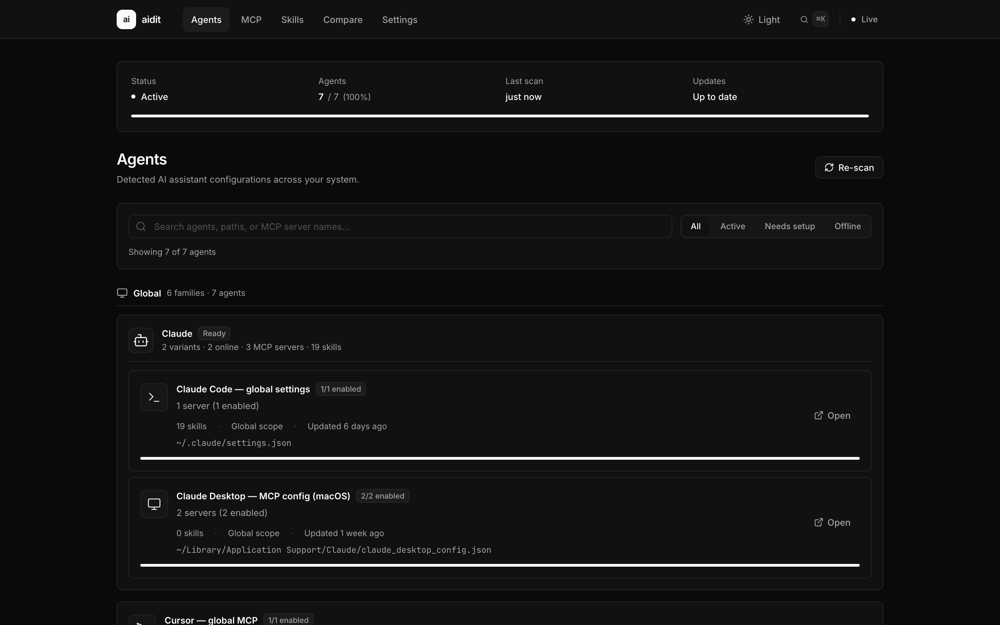
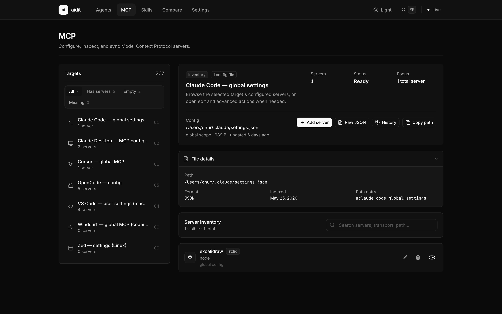
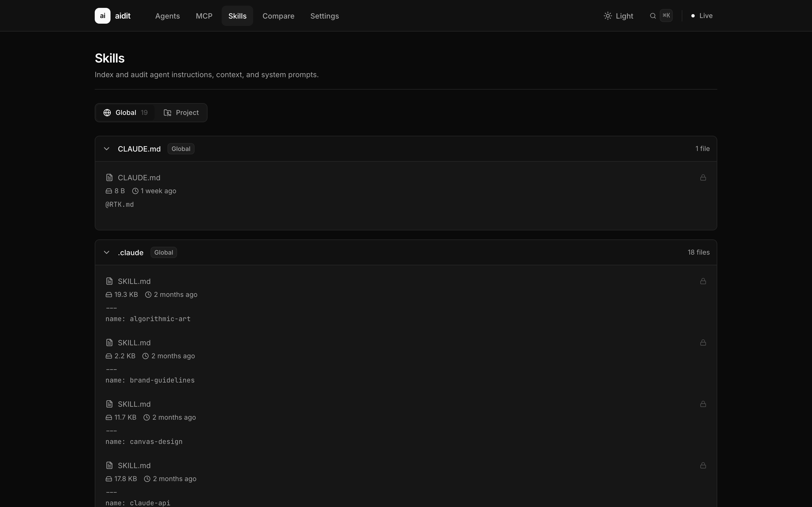
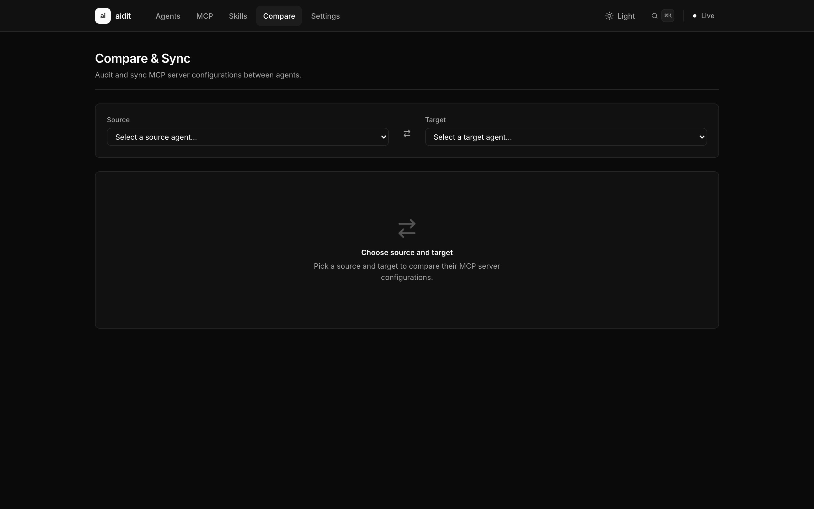
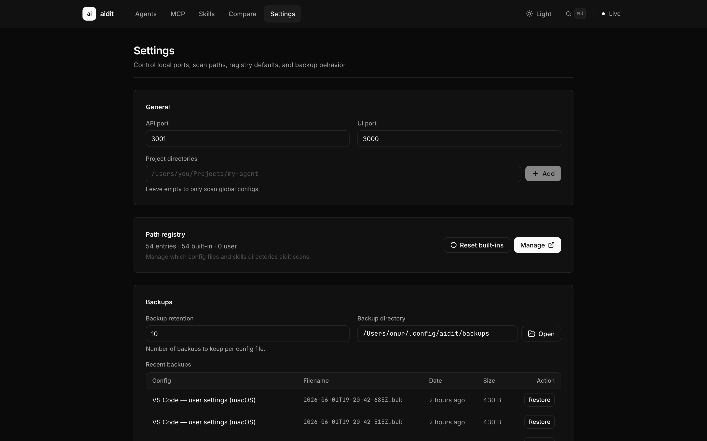
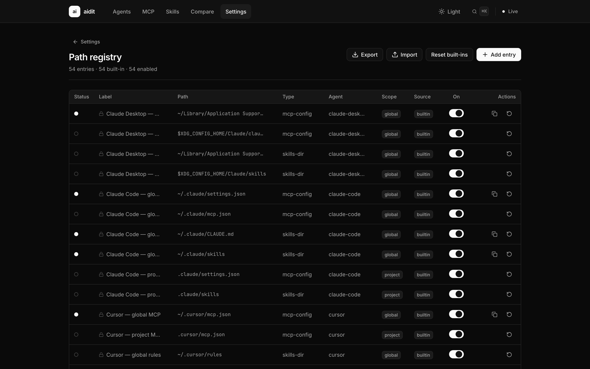

# aidit

> Local web dashboard for managing AI agent MCP configs and skills across multiple tools (Claude Desktop, Cursor, Windsurf, and more). Runs entirely on localhost — no cloud.

[](./LICENSE)
[](https://nodejs.org)
[](https://pnpm.io)
[](#security)

<p align="center">
  
</p>

A single command — `npx aidit start` — launches a local dashboard that scans your machine, surfaces every AI coding agent it can find, and lets you read, edit, diff, and sync MCP server configs and skills across all of them from one place. No cloud, no accounts, no telemetry.

---

## Why aidit?

Modern AI-assisted development is fragmented. Claude Desktop, Cursor, Windsurf, VS Code + Copilot, Goose, Aider, and dozens of other agents each keep their own config files in `~/Library`, `~/.config`, `AppData`, or scattered project directories. Running three agents means three `mcp.json` files you have to keep in sync by hand, and skills folders that no one can see into at a glance.

**aidit** gives you one local window into all of it.

---

## Features

- **Agent overview** — see every AI agent on your machine and which config files each one owns
- **MCP config editor** — read, edit, add, and remove MCP server entries across all agents
- **Skills browser** — view, edit, and create skills folders in each agent's expected location
- **Diff & Sync** — compare two agents' MCP configs side-by-side and copy entries between them
- **Live file watching** — edits you make on disk are reflected in the UI in real time, and vice versa
- **Path registry** — 20+ built-in agent paths, plus full CRUD for custom paths (per-project, per-OS, etc.)
- **Safe writes** — every config file is backed up and validated *before* it touches disk
- **Config history** — restore any file from its previous backup
- **Settings & backups** — UI for managing everything from the dashboard
- **Command palette** — keyboard-driven navigation

---

## Screenshots

| Overview                                    | MCP config                                |
| ------------------------------------------- | ----------------------------------------- |
|   |           |

| Skills                                       | Diff & Sync                                |
| -------------------------------------------- | ------------------------------------------ |
|        |          |

| Settings                                      | Path registry                              |
| --------------------------------------------- | ------------------------------------------ |
|     |        |

---

## Supported agents

aidit ships with built-in path entries for:

| Category       | Agents                                                            |
| -------------- | ----------------------------------------------------------------- |
| Coding agents  | Claude Desktop, Claude Code, Cursor, Windsurf, Aider, Continue, Cline, Roo Code, Goose, Zed, Trae, OpenCode, Augment Code, Void |
| Assistants     | Amazon Q Developer, GitHub Copilot CLI, VS Code + Copilot, Supermaven, Tabnine, JetBrains AI, Warp AI |
| Project-level  | Generic `.aidit/`, `.mcp.json`, and `mcp.json` at repo root       |

Custom paths (per-project, per-OS, anywhere on disk) can be added from **Settings → Paths**.

---

## Installation

### Quick start (recommended)

```bash
npx aidit start
```

No global install needed. On first run, aidit creates `~/.config/aidit/`, initializes its database, and opens the dashboard in your default browser.

### From source

```bash
git clone https://github.com/onur/aidit.git
cd aidit
pnpm install
pnpm build
node bin/aidit.js start
```

---

## Requirements

- **Node.js 20** or later
- macOS, Linux, or Windows (WSL)
- About 100 MB of disk for `node_modules` and the production build

---

## Usage

```bash
aidit start              # Start the server and open the dashboard
aidit start --port 4000  # Use a custom port
aidit start --token      # Generate an auth token for API requests
aidit scan               # Run a scan and print JSON results to stdout (no browser)
aidit --help             # Show help
aidit --version          # Show version
```

The dashboard lives at <http://127.0.0.1:3001> by default.

---

## How it works

aidit is a small pnpm workspace with two packages:

```
┌─────────────────────┐         ┌─────────────────────┐
│  packages/frontend  │  HTTP   │  packages/backend   │
│  React 18 + Vite    │ ◀────▶  │  Express 4 on       │
│  Tailwind + Lucide  │  /api   │  127.0.0.1:3001     │
│                     │  /ws    │  SQLite + chokidar  │
└─────────────────────┘         └─────────────────────┘
                                       │
                                       ▼
                                ~/.config/aidit/
                                ├── aidit.db       # path registry, scan history, write log
                                ├── backups/       # per-file backups
                                └── token          # only if --token is used
```

- The **scanner** reads agent config files using a path registry (built-in + custom). It never writes by default.
- The **safe writer** backs up → validates → atomically replaces any file before exposing a write API.
- A **file watcher** pushes change events over WebSocket so the UI updates in real time.
- The **frontend** is a single-page app served as static assets by Express in production.

For a deeper dive, see [`aidit-product-spec.md`](./aidit-product-spec.md). Build notes for individual features live under [`tasks/`](./tasks).

---

## Data directory

All state lives in `~/.config/aidit/`:

| Path                | Purpose                                  |
| ------------------- | ---------------------------------------- |
| `aidit.db`          | SQLite database (registry, history, log) |
| `paths.json`        | Path registry overrides                  |
| `backups/`          | Per-file backups before each safe write  |
| `token`             | Auth token (only if `--token` is used)   |

aidit never makes outbound network requests. To uninstall, delete the directory.

---

## Security

- **Localhost only** — the server binds to `127.0.0.1`, never `0.0.0.0`. Nothing is exposed to your LAN.
- **No telemetry** — aidit never makes outbound network requests.
- **User permissions** — aidit reads and writes config files using your normal filesystem permissions. It does not require `sudo`.
- **Safe writes** — every config file is backed up to `~/.config/aidit/backups/` before any write, and every write is validated against the agent's expected schema.
- **Optional token auth** — `aidit start --token` generates a random token that must be passed as a `Bearer` header on all API requests. The dashboard reads the token from a local file automatically.

If you find a security issue, please open a [private security advisory](https://github.com/onur/aidit/security/advisories/new) on GitHub. Do not file public issues for vulnerabilities.

---

## Development

```bash
pnpm install
pnpm dev          # frontend :3000 (proxies to backend), backend :3001
pnpm build        # tsc + vite build; produces dist/ in each package
pnpm typecheck    # TypeScript --noEmit
pnpm lint         # ESLint
pnpm format       # Prettier
```

Run a single package:

```bash
pnpm --filter @aidit/backend dev
pnpm --filter @aidit/backend test     # vitest
pnpm --filter @aidit/frontend dev
```

**Tip:** start the backend first (`pnpm --filter @aidit/backend dev`), then the frontend dev server. The Vite dev server proxies `/api` and `/ws` to `127.0.0.1:3001`.

### Repository layout

```
aidit/
├── bin/                        # CLI entry point (aidit start | scan | --help)
├── packages/
│   ├── backend/                # Express + SQLite + watcher + safe writer
│   │   ├── src/
│   │   │   ├── scanner/        # path resolver, config parser, MCP/skills extraction
│   │   │   ├── writer/         # safe writer + backup manager
│   │   │   ├── watcher/        # chokidar + WebSocket server
│   │   │   ├── validation/     # AJV schemas
│   │   │   ├── db/             # SQLite, migrations, write log
│   │   │   ├── registry/       # built-in + custom path registry
│   │   │   └── routes/         # HTTP API
│   │   └── tests/
│   └── frontend/               # React 18 + Vite + Tailwind
│       └── src/
│           ├── routes/         # Overview, McpConfig, Skills, DiffSync, Settings, PathRegistry
│           ├── components/     # AgentCard, McpServerForm, JsonEditor, …
│           ├── context/        # ScanContext, WsContext, ToastContext
│           └── hooks/          # useScan, useWatcher, useConfigWatch
├── tasks/                      # Per-task build notes
└── aidit-product-spec.md       # Canonical product spec
```

---

## Contributing

Contributions are welcome! Please:

1. Open an issue first for non-trivial changes so we can agree on the approach.
2. Fork the repo and create a feature branch from `main`.
3. Run `pnpm lint`, `pnpm typecheck`, and `pnpm build` before pushing.
4. Open a pull request using the provided template.

For new agent support, add an entry to `packages/backend/src/registry/builtins.ts` and an icon mapping to `packages/frontend/src/lib/icons.ts`.

---

## Roadmap

aidit is at v0.1. The full plan is in [`aidit-product-spec.md`](./aidit-product-spec.md). Short-term:

- [ ] Auto-detect config-file changes from agent UIs (Cursor, Claude Desktop, …)
- [ ] Export / import aidit path registry as a sharable bundle
- [ ] Plugin SDK for community-built scanner adapters
- [ ] Tauri / native shell wrapper

---

## License

[MIT](./LICENSE) © 2026 aidit contributors

---

## Acknowledgments

Inspired by tools like [Homebrew](https://brew.sh), [Raycast](https://www.raycast.com), and the [Linear](https://linear.app) approach to focused, fast, local-first software.
